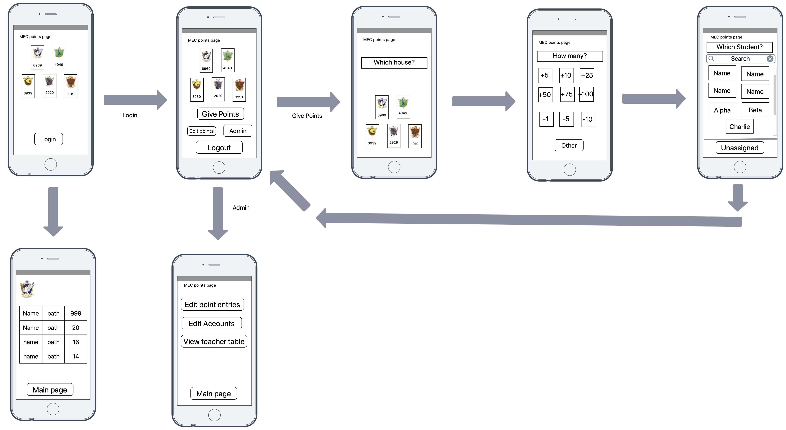
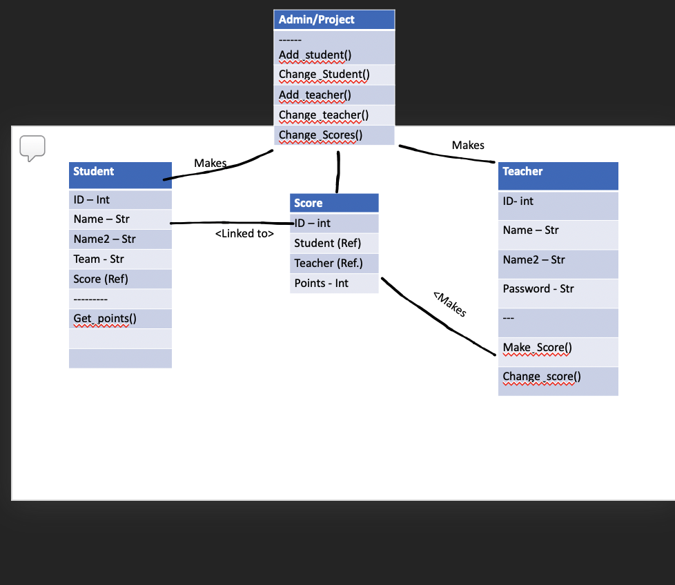

# Design of the Project

## Features of the application

### Minimum viable product

- allow for an admin account to make teacher accounts
- allow teachers to log in and hand out points to houses
- allow teachers to edit their own old 'hand-out entries'
- produce a dynamic table containing the ranking between the houses visible to all visitors
- allow admin account to edit individual teacher handout entries and to reset the points database when the LARP is over
- Produce a dynamic table containing the points given by individual teachers to each house, visible only to the admin
- User interface must be clear, intuitive and aimed at mobile devices
- The website must be safe to use, and prevent SQL-injections.

### optional features

- allow admin to upload student database, which includes their real name, their In-Game name and their house.
- allow admin to manually edit individual student entries if a participant changes house throughout the LARP.
- allow teachers to give points to individual students. The application matches their name to their house and allocates points appropriately.
- allow visitors to see rankings *inside of* a house, to see which members gathered the most/least points of each individual house.
- allow a modified user interface for the Admin, who will likely be using a PC.
- allow admin to download all hand-out entries as an Excel-file for administration and safe-keeping.
- allow for automatic back-ups to another location after 5 entries.

## Sketches of the Webapplication and User Interface

Below is a picture that walks the reade through the likely user interface. Although detailed, it is not an 100% identical representation of the final product!

- 

## Database Design -pre project

This webapplication utilizes a database hosted on the internet. For testing purposes; Heroku will be used as a hosting platform. The user is ofcourse free to link up the application to any SQLAlchemy database online. Below is a UML diagram that outlines the different tables and fields in the database.

- 

## Database Design -Post project

The database consists of four tables. A user table, that functions as a collection of user data. A teams table, which gives each team a name. A student table that links each student to a team. And finally PointEntry's that link a number of points to a teacher that gives them, a student who'm they're given to and the team of said student.

## Lists

### API's

Below is a list of frameworks used and what they are used for.

- Django, used as content management system and database manager
- Bootstrap 4, used to beautify the site
- Jinja2, used to dynamically generate websites
- SQLite3, database system

### Datasources

The data in for testing is a fictional database, containing students, teachers and teamnames, in this case houses. As an example of the data used, I refer to a PDF [PDF-file](doc/Character_list_for_players.pdf) that provides testingdata. That data will be  manually entered into a Django Admin interface.

## Sanity Check

Done.
